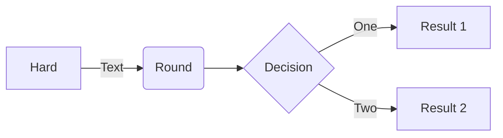
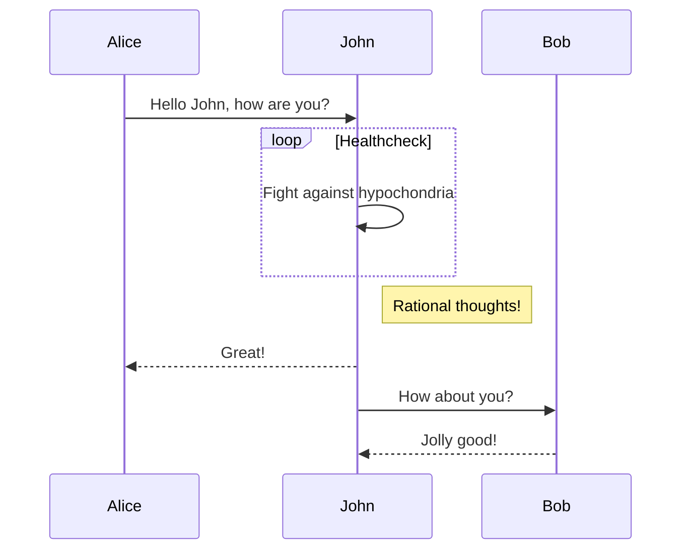
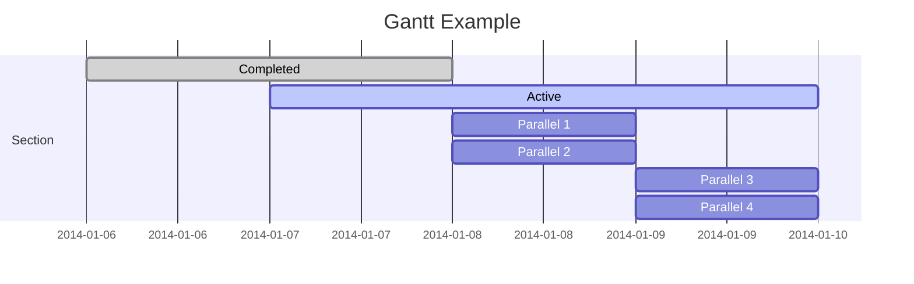
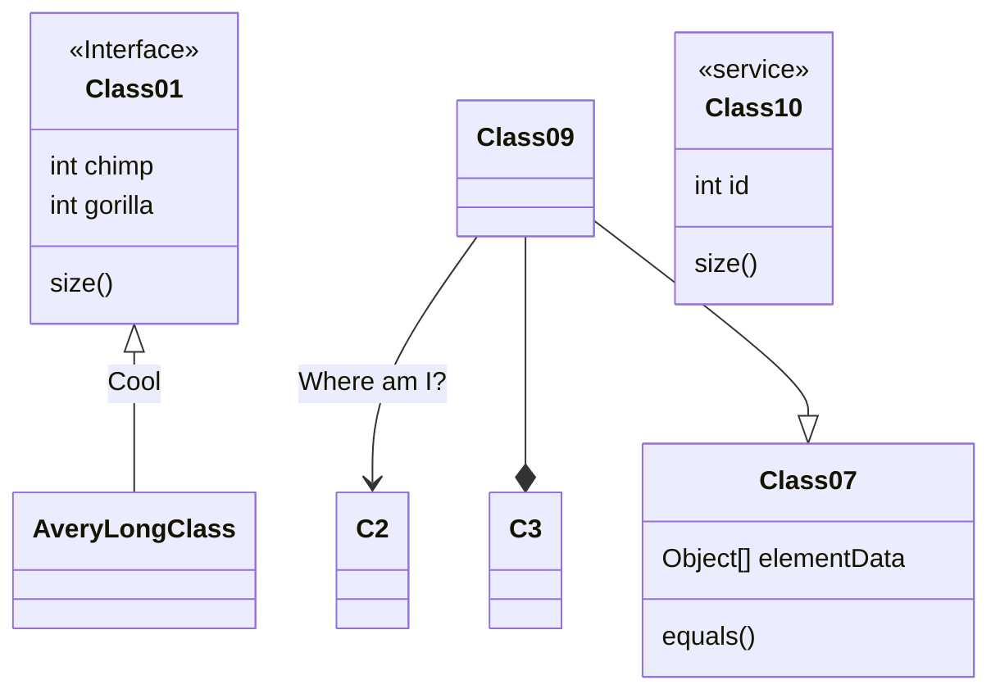
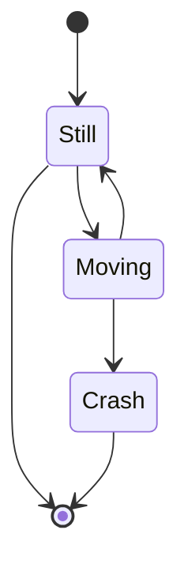
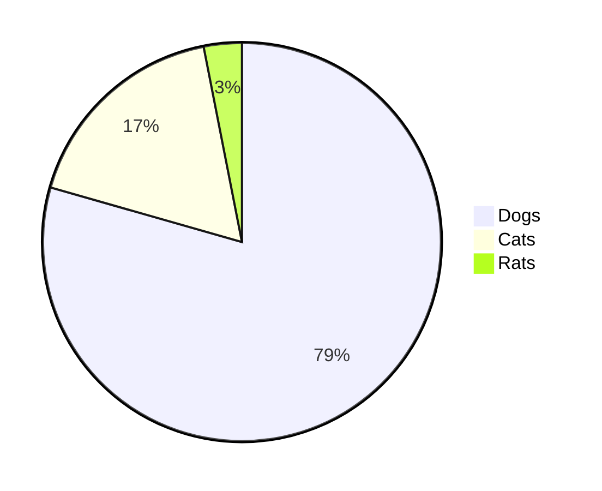
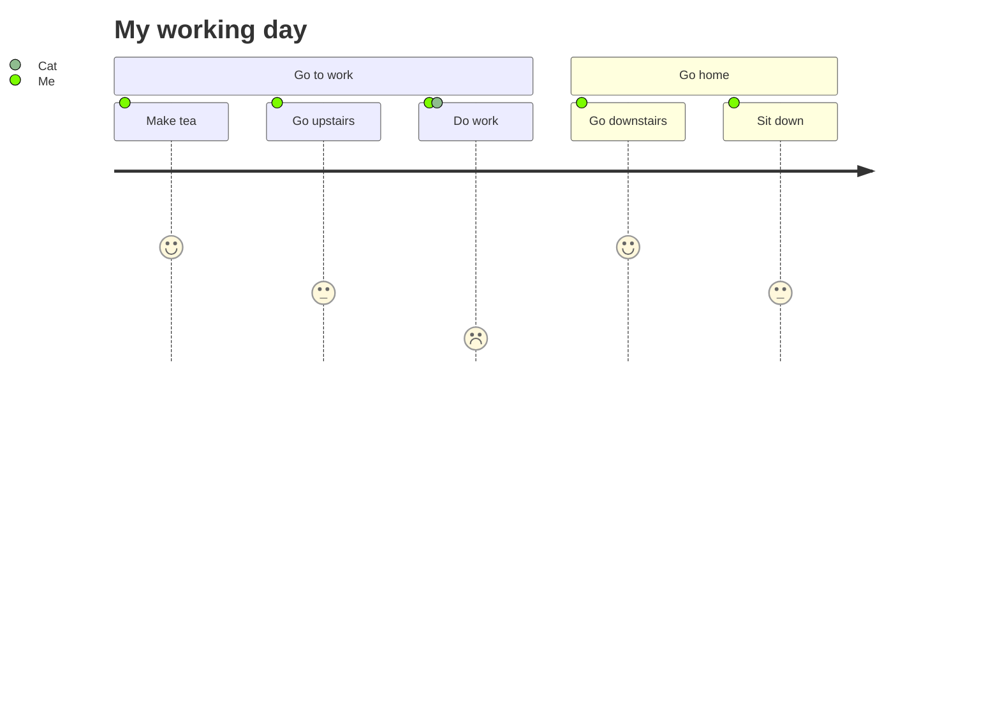

| 新建脑图     | Ctrl/Cmd+P          |
| ------------ | ------------------- |
| 新增子节点   | Tab                 |
| 新增兄弟节点 | enter               |
| 删除节点     | Delete              |
| 编辑节点     | Space/dblclick node |
| 后退         | Ctrl/Cmd+Z          |
| 前进         | Ctrl/Cmd+Y          |
| 取消编辑节点 | Tab                 |
| 展开节点     | Ctrl/Cmd + /        |
| 收缩节点     | Ctrl/Cmd + /        |
| 拖动节点     | Drag and drop node  |
| 切换节点     | Up/down/left/right  |
| 放大、缩小   | Ctrl/Cmd + 滚轮     |
| 居中         | Ctrl/Cmd + E        |

改变编辑区宽度可以在 设置 - 外观 - 主题 - 打开文件夹 - 打开css样式文件 - body中添加／修改以下代码：
``` css
body {
  --file-line-width: 1100px; // 控制编辑区宽度
}
```
# 一级标题
一级标题
===
%%三个短横配合一级标题使用%%
## 二级标题
### 三级标题
#### 四级标题
##### 五级标题
###### 六级标题
------
# 文字
## 推荐
*斜体文本*,**粗体文本**,***粗斜体文本***,~~删除~~,==高亮==
## 少用
_斜体文本_,__粗体文本__,___粗斜体文本___,<u>带下划线文本</u>

------
# 换行
一行内容后两个空格一个回车

------
# 脚注
脚注 [^one]

[^one]: 脚注内容

这是一个脚注 [^1]。之后继续写正文。 第二段开始，一直写到文末 [^2]。 但需要注意，正文和文末的脚注直接要有一个空行，并且脚注所用的符号都是英文符号。

------
# 段落
* 第一项
* 第二项
* 第三项

+ 第一项
+ 第二项
+ 第三项

- 第一项
- 第二项
- 第三项

1. 第一项
2. 第二项
3. 第三项

+ 第一项：
    - 第一项嵌套的第一个元素「引号」
    - 第一项嵌套的第二个元素
+ 第二项：
    - 第二项嵌套的第一个元素
    - 第二项嵌套的第二个元素
```diff
+ 新增
- 删除
```

------
# 区块
> 区块
> 最外层
> > 第一层嵌套
> > > 第二层嵌套
------
# 代码
```javascript
$(document).ready(function () {
    alert('js');
});
```
或

    <html></html>

------
# 网页链接
这是一个链接 [菜鸟教程](https://www.runoob.com描述)

这个链接用 google 作为网址变量 [Google][google]

  [google]: http://www.google.com/

------
# 图片
```markdown

```


这个链接用 1 作为网址变量 [RUNOOB][1].

  [1]: http://static.runoob.com/images/runoob-logo.png

------
# 表格
| 左对齐 | 右对齐 | 居中对齐 |
|:------ | ------:|:--------:|
| 单元格 | 单元格 |  单元格  |
| 单元格 | 单元格 |  单元格  |

------

# 任务列表
- [x] Write the press release
- [ ] Update the website
- [ ] Contact the media

------

# 表情
:blush: &emsp; 更多表情参考[表情符号简码列表](https://gist.github.com/rxaviers/7360908)

------

# 自动网址链接
http://www.example.com
`http://www.example.com`

------

# 定义列表
term
: definition
: 222
      333

---

# 数学公式
***
知乎归纳部分数学公式 https://zhuanlan.zhihu.com/p/52347414
基本齐全 https://blog.csdn.net/dabokele/article/details/79577072
数学符号大全 http://mohu.org/info/symbols/symbols.htm
%%LaTeX 语法%%

$$\begin{vmatrix}
a & b\\ c & d
\end{vmatrix}=ad-bc$$

* * *
换色
$$\color{red}{\sqrt{\overline{m} + {n}},E=mc^2}$$

*****
$$\sum_{i=m}^{n}(3x-1)\cap\prod_{i=m}^{n}(2y-4);\iiint_{1}^{33}3x-1$$
---

# 图表
其他图表查看 mermaid [^3]
属性说明文档 https://mermaid.js.org/syntax/flowchart.html
简易非官方教程 https://blog.csdn.net/u011315681/article/details/120228833

## 流程图


## 时序图


## 甘特图

## 类图


## 状态图



## 饼图


## 用户体验旅程图


---
## obsidian：
### 设置
字体：Fira Code, 华文黑体；同VSCode字体
关闭核心插件中的日记功能
### 插件
#### Admonition
##### 关键字

|   Type   |           Aliases           |
|:--------:|:---------------------------:|
|   note   |        note, seealso        |
| abstract |   abstract, summary, tldr   |
|   info   |         info, todo          |
|   tip    |    tip, hint, important     |
| success  |    success, check, done     |
| question |     question, help, faq     |
| warning  | warning, caution, attention |
| failure  |   failure, fail, missing    |
|  danger  |        danger, error        |
|   bug    |             bug             |
| example  |           example           |
|  quote   |         quote, cite         |
##### 参数
```ad-<type> # Admonition。有关可用类型的列表，请参见下文。
title:                  # Admonition标题.可以使用数学公式
collapse:            # 创建可折叠的Admonition。
icon:                  # 覆盖图标。必须是来自FontAwesome或RPGAwesome的确切图标名称
color:                 # 覆盖颜色。必须是 RGB 三元组

这是一段文本内容.......
```
##### example
- 参数的使用
```ad-note
title: $\sum\frac{\pi }{\sigma }-sin(x)$
collapse: open
icon: triforce
color: 200, 30, 200

Lorem ipsum dolor sit amet, consectetur adipiscing elit. Nulla et euismod nulla.
```
- 没有内容的Admonitions将仅呈现为标题栏
```ad-warning
title: This admonition is closed.
collapse: close
```
- 在 Admonitions中呈现代码块
````ad-info

```ad-bug
title: I'm Nested!
~~~javascript
throw new Error("Oops, I'm a bug.");
~~~
```

```javascript
console.log("Hello!");
```
````
#### Advanced Tables
##### 使用
1. 输入`|`;
2. 输入列标题，然后按`Tab`键；
3. 重复第二步，直到所有标题输入完毕，然后按`回车`键；
4. 此时光标来到表格的第一行；
5. 输入列的内容，然后按`Tab`键；
6. 重复第五步，直到所有列的内容输入完毕，如果需要增加新行，按`回车`键；
##### 说明
右上角会出现快捷面板，功能包括
- 设置列的对齐方式
- 行的上移、下移
- 列的左移、右移
- 插入行
- 插入列
- 删除行
- 删除列
- 以光标所在列为基础对表格进行正向、逆向排序
- 将表格导出为 CSV 文件

#### Calenar
##### 设置
设置 - 插件选项 - Calendar - show week number
##### 说明
右上角会出现快捷面板，点击即可创建对应日期或对应周的md文件

#### Completr
Latex语法自动补全插件

#### Editing Toolbar
编辑区顶部出现markdown快捷输入

#### Enhancing Mindmap
markdown和思维导图相互转换
##### 开启方式
```
---
mindmap-plugin: basic
---
```
##### 快捷方式

| 新建脑图     | Ctrl/Cmd+P          |
| ------------ | ------------------- |
| 新增子节点   | Tab                 |
| 新增兄弟节点 | enter               |
| 删除节点     | Delete              |
| 编辑节点     | Space/dblclick node |
| 后退         | Ctrl/Cmd+Z          |
| 前进         | Ctrl/Cmd+Y          |
| 取消编辑节点 | Tab                 |
| 展开节点     | Ctrl/Cmd + /        |
| 收缩节点     | Ctrl/Cmd + /        |
| 拖动节点     | Drag and drop node  |
| 切换节点     | Up/down/left/right  |
| 放大、缩小   | Ctrl/Cmd + 滚轮     |
| 居中         | Ctrl/Cmd + E        |

#### Excalidraw
可以创建手绘风格的流程图，也可直接当画布

#### Hightlightr
文档内容<mark style="background: #ADCCFFA6;">高亮</mark>
##### 使用方法
选中 - 右键 - Highlight

#### IconFolder
给文件换个图标，可以单独设置，也可以给文件夹设置继承图标，文件夹中所有文件都会自动使用继承图标

#### Natual Language Dates
```ad-note
title: 使用方式

在页面直接输入`@`，就能激活插件，然后可以输入时间，例如today、next
@Today
@Yesterday
@Tomorrow
@next ...
```

#### Note Refactor
拆分文档
##### 使用方式
进行命令模式（默认为`ctrl+P`)，在弹出的命令中可以找到Note refactor相关的命令。
##### 命令详情
- Note Refactor: Extract selection to new note-first line as file name：划分文档，第一行作为文件名
- Note Refactor: Extract selection to new note-content only
- Note Refactor: Split note here- first line as file name
- Note Refactor: Split note here-content only
- Note Refactor: Split note by headings-h1：按H1的标题（`#`）来分割文档
- Note Refactor: Split note by headings-h2：按H2的标题（`##`）来分割文档
- Note Refactor: Split note by headings-h3：按H3的标题（`###`）来分割文档

#### Periodic Notes
日记管理工具，右侧栏会出现一个按钮
##### 使用
右侧会出现一个小按钮，左键点击创建，右键点击选择其他日期

#### Privacy Glasses
隐私模式(毛玻璃效果)，右侧栏会出现三个按钮：
- 隐私模式
- 显示非隐私
- 显示全部

#### Reading Time
右下角显示文档阅读时间

- - -
