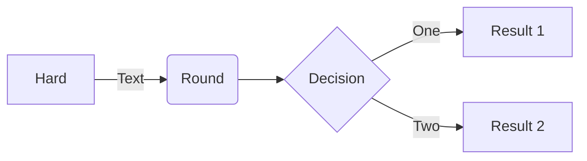
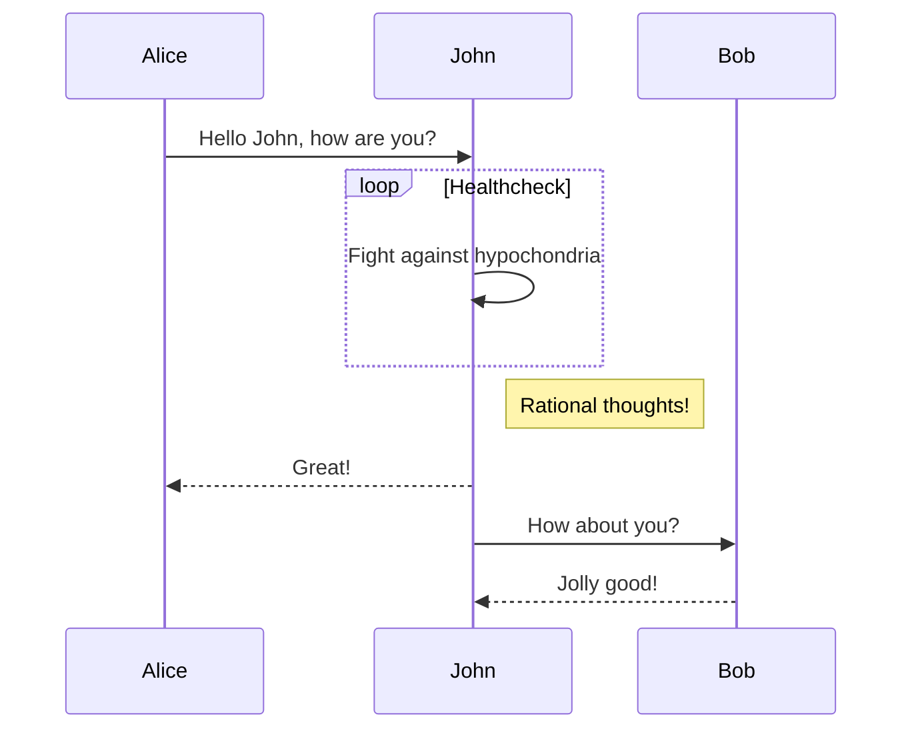
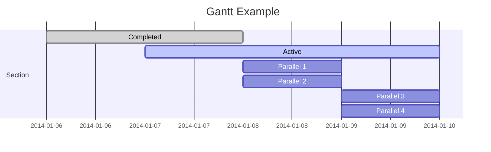
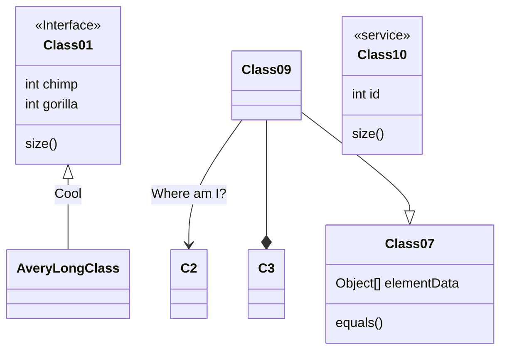
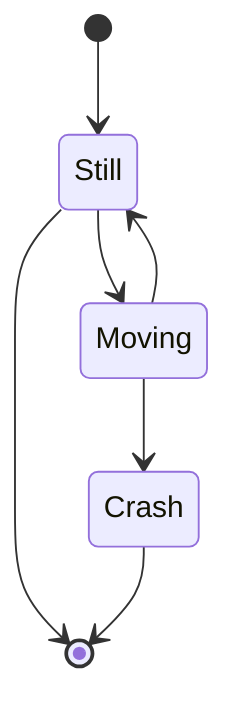
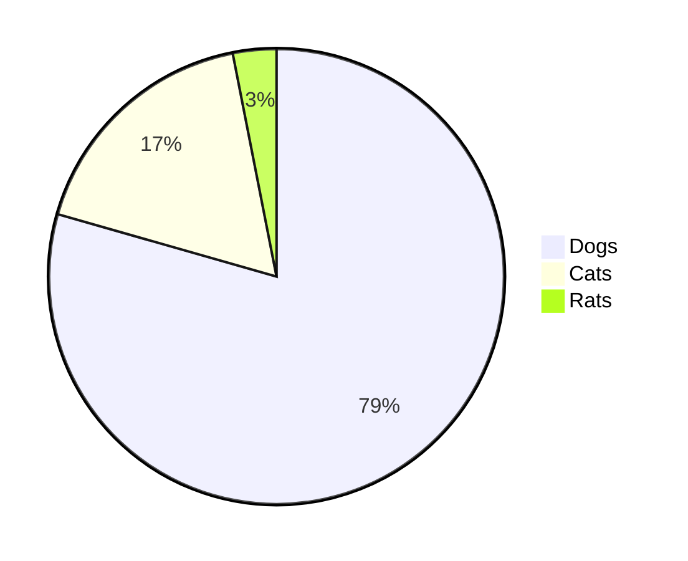
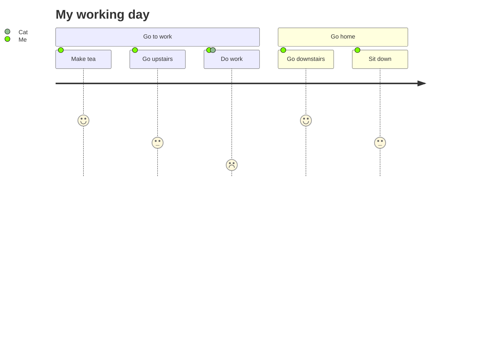

``` ad-tip
启用思维导图模式
---
mindmap-plugin: basic
---
```
| 新建脑图     | Ctrl/Cmd+P          |
| ------------ | ------------------- |
| 新增子节点   | Tab                 |
| 新增兄弟节点 | enter               |
| 删除节点     | Delete              |
| 编辑节点     | Space/dblclick node |
| 后退         | Ctrl/Cmd+Z          |
| 前进         | Ctrl/Cmd+Y          |
| 取消编辑节点 | Tab                 |
| 展开节点     | Ctrl/Cmd + /        |
| 收缩节点     | Ctrl/Cmd + /        |
| 拖动节点     | Drag and drop node  |
| 切换节点     | Up/down/left/right  |
| 放大、缩小   | Ctrl/Cmd + 滚轮     |
| 居中         | Ctrl/Cmd + E        |

改变编辑区宽度可以在 设置 - 外观 - 主题 - 打开文件夹 - 打开css样式文件 - body中添加／修改以下代码：
``` css
body {
  --file-line-width: 1100px; // 控制编辑区宽度
}
```
# 一级标题
一级标题
===
%%三个短横配合一级标题使用%%
## 二级标题
### 三级标题
#### 四级标题
##### 五级标题
###### 六级标题
------
# 文字
## 推荐
*斜体文本*,**粗体文本**,***粗斜体文本***,~~删除~~,==高亮==
## 少用
_斜体文本_,__粗体文本__,___粗斜体文本___,<u>带下划线文本</u>

------
# 换行
一行内容后两个空格一个回车

------
# 脚注
脚注 [^one]

[^one]: 脚注内容  

这是一个脚注 [^1]。之后继续写正文。 第二段开始，一直写到文末 [^2]。 但需要注意，正文和文末的脚注直接要有一个空行，并且脚注所用的符号都是英文符号。

------
# 段落
* 第一项
* 第二项
* 第三项

+ 第一项
+ 第二项
+ 第三项

- 第一项
- 第二项
- 第三项

1. 第一项
2. 第二项
3. 第三项

+ 第一项：
    - 第一项嵌套的第一个元素「引号」
    - 第一项嵌套的第二个元素
+ 第二项：
    - 第二项嵌套的第一个元素
    - 第二项嵌套的第二个元素
```diff
+ 新增
- 删除
```

------
# 区块
> 区块
> 最外层
> > 第一层嵌套
> > > 第二层嵌套
------
# 代码
```javascript
$(document).ready(function () {
    alert('js');
});
```
或

    <html></html>

------
# 网页链接
这是一个链接 [菜鸟教程](https://www.runoob.com描述)

这个链接用 google 作为网址变量 [Google][google]

  [google]: http://www.google.com/

------
# 图片
```markdown

```


这个链接用 1 作为网址变量 [RUNOOB][1].

  [1]: http://static.runoob.com/images/runoob-logo.png

------
# 表格
| 左对齐 | 右对齐 | 居中对齐 |
|:------ | ------:|:--------:|
| 单元格 | 单元格 |  单元格  |
| 单元格 | 单元格 |  单元格  |

------

# 任务列表
- [x] Write the press release
- [ ] Update the website
- [ ] Contact the media

------

# 表情
:blush: &emsp; 更多表情参考[表情符号简码列表](https://gist.github.com/rxaviers/7360908)

------

# 自动网址链接
http://www.example.com
`http://www.example.com`

------

# 定义列表
term
: definition
: 222
      333

---

```ad-tip
生成日期
@Today
@Yesterday
@Tomorrow
```

---

# 数学公式
***
知乎归纳部分数学公式 https://zhuanlan.zhihu.com/p/52347414
基本齐全 https://blog.csdn.net/dabokele/article/details/79577072
数学符号大全 http://mohu.org/info/symbols/symbols.htm
%%LaTeX 语法%%

$$\begin{vmatrix}
a & b\\ c & d
\end{vmatrix}=ad-bc$$

* * *
换色
$$\color{red}{\sqrt{\overline{m} + {n}},E=mc^2}$$

*****
$$\sum_{i=m}^{n}(3x-1)\cap\prod_{i=m}^{n}(2y-4);\iiint_{1}^{33}3x-1$$
---

# 图表
其他图表查看 mermaid [^3]
属性说明文档 https://mermaid.js.org/syntax/flowchart.html
简易非官方教程 https://blog.csdn.net/u011315681/article/details/120228833

## 流程图


## 时序图


## 甘特图

## 类图


## 状态图



## 饼图


## 用户体验旅程图



- - -